Ponies
================
Peter Rabinovitch
2022-11-10 15:23:48

At the start of the covid pandemic, when nobody left their couch, I
started a blog series on using data science to make money at the horse
racing track (spoiler alert: you won’t). Most of the work had happened a
few years earlier, and some of it had been used as examples for the
course I teach - but I figured with all the free time I had, I’d make it
more widely available.

Here I am just cleaning it up a bit and moving it from Wordpress to
github, so you will see reference to ‘next week’, ‘last week’, etc. They
(obvs) no longer apply.

# Part I

## Why I am writing this blog

I am writing this blog so that data scientists who are just starting out
can see how a complete project can be done, one that could be useful,
and that was a lot of fun to work on. It is not a text – there are no
real exercises (except perhaps a compendium of ideas to take this work
further). However it does demonstrate the process of doing a data
science project from beginning to end, and there are many ways it could
be extended.

I tell everybody who asks how to get started in data science to find a
data set you care about and data-science the heck out of it. This is my
attempt at doing just that.

## How I got started

A million years ago, on Sunday afternoons when most kids were playing
ball with their fathers, I was at the track with mine. I learned a lot
about horse racing without really trying, just through osmosis, and
never thought it would come in handy – other than to have a few cool
stories to tell.

Flash forward about nine hundred thousand years, and I was looking for
something interesting I could put in my data science portfolio to show
potential employers. All the work I had done in my career was covered by
non-disclosure agreements, and so there was little I could say about
that, other than vague generalities.

Once I hit on the idea of horse racing – it was a natural. I already had
enough domain knowledge, data was available from various sources, it was
easy enough to explain to anyone, and if I was really smart and lucky, I
could make some money (although I was not foolish enough to actually
believe that).

The next decision was what tool to use: R or Python. I was skilled
enough with both, and up until that point my workflow had a split
personality. I would gather and massage data in python, and once the
data set was prepared, I’d export it as a csv and read it into R, where
I would do my modelling, statistics, and plotting. And this seemed
inefficient, so I set myself the task of doing everything in R.

Why R as opposed to python? You wouldn’t believe how many times I get
asked that question. It is largely a matter of preference, and to
anybody starting out I’d recommend learning the basics of both – but for
me there are two main reasons for choosing R:

-   The tidyverse of packages fits my brain better than pandas. It just
    flows from my brain through my fingertips into code that works

-   Most stats researchers do their work in R. There have been several
    times in my career, when dealing with funky data sets, that I’d
    discover that the best way to deal with a particular statistical
    issue had just been put on some researcher’s web site in
    pre-publication form, and they had R code illustrating the method.
    Sure I could translate to python, but then I’d be wasting time and
    trying to make sure my python code did exactly what their R code
    did. Much simpler to stay in R.

Later I learned about reproducible research and knitr, markdown, etc and
that just solidified my preference. So, for me, R is my preferred tool.

But, if you prefer python I suppose you could translate the code herein,
or just find one of the many excellent python/data science resources out
there.

## This will *not* make you rich

Well, it might teach you some data science, and that can be a good
career. Or you might take what is presented here and extend it way, way
beyond what is discussed here. But just following the steps here will
not – trust me. If it did I’d be typing this from a beach in the
Bahamas. I am not.

## *Real* data isn’t mine to give

There are several organizations that sell the results of horse races in
various geographic areas. I am not, nor do I want to be in competition
with them. I simply want to do some interesting data science on a real
problem, and for you to follow in my footsteps, and then step beyond.
So, I have morphed the original data so that it doesn’t compete with
data from those organizations that make a living from their data.
Consider it realistic horse racing data from an alternate universe. One
would expect, however, that any statistical results derived with this
data are likely to be applicable, perhaps with some modification, to the
real world.

Ideally, the results derived herein would be usable by the reader, who
could obtain race results from their track, adapt their data to the
formats used here, and run these and other analyses with minimal pain.

The data we use at first was scraped from various web pages- all using
R. It was quite a chore, not because R wasn’t up to the task, but
because the web pages were so badly constructed. I will describe some of
the issues in a later post, as collecting data, finding the problems,
and fixing it is a large part of the data scientist’s work.

Later we may use publicly available horse racing data sets, including
one found on Kaggle by using the amazing [Google’s data set
search](https://toolbox.google.com/datasetsearch)

## Who helped?

The data science community is truly wonderful: open, giving and
supportive. I wish I could name all the blogs that have helped in one
way or another – but I lost track long ago. Similarly for all the
package writers, but in particular the tidyverse community has made my
data science efforts much easier. I have given students assignments
based on subsets of this data, and my thanks go out to them for vetting
it and finding things I didn’t know were there.

Perhaps most importantly, I would like to thank a jockey at a family day
open house at Blue Bonnets in the early ’70’s who did not punch me in
the face when I asked him what a boat race was.

## So what’s the plan?

Now that this term of school is over, and we are all keeping our
distance from each other, I have some time. So I will take this
opportunity to attempt to do weekly blog entries….until I have nothing
left to say.

We will first talk about horse racing and the little bits you need to
know. Then we will talk about getting & cleaning data, followed by some
exploratory data analysis (EDA). After that we will build some simple
models to predict the winner of a race, and see that some simple models
can do pretty well, but not well enough to get rich. We will then
discuss some simple betting strategies and see if they can make us rich
(spoiler alert, no). And then, at the very least, we will list some next
steps that could be taken….I say at the very least because we may pursue
some of them here.

## Some comments

IMHO a huge part of data science is ethics:

-   speaking the truth regardless of pressure to report a particular
    message

-   being aware of potential negative outcomes of a study and mediating
    them

-   having respect for personally identifiable information (PII)

-   giving credit where it is due to all the wonderful people who have
    helped advance the field

And then we come to horse racing. When I was a kid, I didn’t think about
it at all. It was just a way to spend time with my father. Now that I’ve
gotten older, I have come to think that horse racing is a pretty cruel
sport. Doubtless there are many owners, trainers, jockeys and people
associated with the sport in many ways who are kind, caring, and
concerned about the horses’ well being. But equally I’m sure that there
are some who are not. But, it does seem there are some horses that enjoy
the sport, such as
[Bodexpress](https://www.usatoday.com/story/sports/horses/triple/preakness/2019/05/18/2019-preakness-stakes-bodexpress-runs-race-without-jockey/3726204002/).
You can Google, read, and make your own decisions. Regardless of that,
the data is still interesting and illustrative. Hence this blog.

# Part II

In this part we describe the basics of what horse racing knowledge you
need.

## About horse racing

The first horse race probably happened when the first two people who had
horses encountered each other and one of them said “I bet my horse is
faster than yours”. Flash forward a few years and organized horse racing
is a popular form of gambling and entertainment all around the world, as
well as being a great place for budding data scientists to learn their
craft.

If you want to see what can be done with money and time – have a look at
[this](https://www.bloomberg.com/news/features/2018-05-03/the-gambler-who-cracked-the-horse-racing-code).

## Types of horse racing

There are several types of horse races: thoroughbreds, like those that
race in the Kentucky Derby; steeplechase, where the horses must jump
over obstacles in the race; and harness racing, where the driver sits in
a small cart behind the horse. All forms have their fans and detractors.
Harness race horses can further be subdivided into pacers and trotters.
Pacers move with both legs on one side moving in unison, whereas
trotters don’t. Typically trotters are a little faster than pacers, and
at least from what I have seen they never race each other.

To simplify matters, we only discuss thoroughbreds in what follows.

## A day at the races

The first thing you must do when you arrive at the track is get a
program. This may range from a few pieces of photocopied paper to a
small glossy magazine, and it contains details about all the races that
day, including which horses are in which race. There will be a bunch of
information about each horse and race, so the next thing you must do is
find the nearest concession and buy a hotdog and a Coke. This is not
optional, as to make money at the track you need to fuel your brain.

Now find a place to sit and browse the program. The program lists all
the races for that day, which horses are in each, which jockey is riding
them, the length of the race, the prize money, and the initial odds on
each horse. There is usually much more info than that, but now you have
an idea of what is available.

The horses make their way on to the track and trot around to warm up.
All this time (and before) people are betting on whoever they think they
can make money from. At *post time*, no more betting on that race can
occur, the horses line up at the starting gate, and the race begins.
Roughly two minutes later, depending on the length of the race, the
horses finish, and if you are lucky you can go cash in your winning
tickets.

And then we do it all over again, roughly ten times. I personally have
seen as few as four races and as many as twelve in one day.

The horses race in all kinds of weather, and unless there are safety
concerns, the races are rarely cancelled due to bad weather. Some horses
adapt better than others to rain, snow, heat, etc. so knowing which
horses prefer the current conditions can offer you an advantage.

Sometimes a horse gets sick or injured prior to the race, and is
*scratched*, i.e. she doesn’t race.

And some times a horse violates the rules in some way, and after review
by the stewards can be disqualified.

## Some details about betting

There are many different types of bet than can be made. The simplest are
to bet on a horse to win, place (finish first or second), or show
(finish first, second or third). Most tracks have a minimum bet,
typically $2, and bet in units of dollars. In other words, you can not
bet $7.43.

There are a variety of fancy bets you can make, such as a quinella (pick
the first two horses in any order), a daily double (pick the winner in
two consecutive races) and a trifecta (pick which horse finishes first,
second, and third in one race). Not all betting types are available in
all races, but the program will tell you all you need to know.

By now you are wondering ‘How much money will I win?’ I will describe
the simplest case – betting on one horse to win.

Let’s say that all the people at the track bet in total the following
amounts:

| Horse     | Total Amount Bet |
|-----------|-----------------:|
| Alfie     |             $200 |
| Betty     |              $50 |
| Carl      |            $1000 |
| Donnie    |             $800 |
| Ethan     |             $600 |
| **Total** |        **$2650** |

The first thing that happens is that the track takes their money out of
this pool, typically about 20%. This covers their cost of running the
track (electricity, prize money, salaries, etc) as well as their profit.
This *take* of 20% varies from track to track, here we will assume
exactly 20%. So what is left, $2120, will be distributed among the
winners, proportional to how much they bet.

So, say you bet $2 on Alfie, who wins. You would be entitled to
2/200\*2120, or $21.20. And if you bet on any other horse to win, you’d
get back nothing.

On the other hand, if you bet $2 on Carl and he won, you’d get back
2/1000\*2120 or $4.24.

These numbers determine the ‘odds’, the ratio of what you win to what
you bet, i.e. 21.20/2 = 10.6, or 4.24/2 = 2.12 respectively. Ok, that
was a bit of a lie – typically the odds are expressed as fractions, so
10.6 to 1, and 4.24 to 1. Another lie – they are rounded to convenient
numbers, so 10.6 to 1 would probably be quoted as 10 to 1, and 2.12 to 1
would be simply 2 to 1. These are often expressed as 10:1 and 2:1. You
may also see odds with the second number being 2, as in 7:2, or 4, as in
5:4. Of course 7:2 is the same as 3.5:1.

There may also be rules for rounding the winnings to the nearest $0.05,
or really anything the local track and ruling body decides, so check the
rules at your local track before you bet – the above are just
illustrative.

A horse with low odds is referred to as a *favourite*, and a horse with
high odds is a *long shot*.

When it is decided what horses are going to compete in a particular
race, an expert may determine their initial odds, which is her view of
what the final odds will be, and these may be published in the program
or local newspaper. But as you saw above, the actual odds are determined
by who bets on each horse. And as more money is bet, these odds change,
right up until the last bet is made at post time. So, the odds you see
when you bet are not necessarily the odds you get because more people
can bet after you and change the odds. In fact, your bet changes the
odds too.

This is referred to a parimutuel betting, where the pool, after the
take, is split among the winners in proportion to how much they bet.
Losers get nothing.

## Other factors

Just as some horses are better than others, some jockeys (riders) are
better than others, and some trainers are better than others. And you
can expect interactions, i.e. a particular jockey may be great for one
horse, but lousy for another.

A horse races at most once per day, but a jockey can race many times per
day, and just because last Tuesday your favourite jockey rode your
favourite horse does not mean that she will always be riding that horse.
The owners can and do change their jockeys and trainers as they see fit.

Earlier races are typically slower, with less competitive horses, and
for less prize money than the later races.

# Part III

## What about the data?

Now that I’ve described the project, and told you most of what you need
to know about horse racing, the next issue is where to get data.

Many moons ago I found a web site that displayed the results of the
races at a track, as well as the schedule for the upcoming races. I
don’t recall how I found the data, most likely following breadcrumbs
after a Google search (or three hundred). In any case, there was the
data I needed. It was only in html, so there would be some work to parse
it, but that was ok, that was part of the work to be done, and part of
the data scientist’s job.

Then I read the terms of service, which explicitly said that I could use
the data for my own purposes, but could not sell or redistribute it.
Fair enough – the owners of the site probably had a deal with some
company to sell the data, and I did not want to interfere in any way.
There was also a statement about how automatically copying the data was
forbidden. I contacted the website administrator who put me in touch
with whoever was in charge of their data. After several emails where I
explained that I wanted the data just for data science educational
reasons, I was told I could scrape the data as long as:

1.  I did not sell or redistribute the data in any form that could be
    linked back to the original data, so as to not compete with the
    owners of the data, and

2.  that if at anytime they noticed any adverse effects due to my
    auto-scraping I would immediately be blacklisted.

To address 1) was pretty straightforward. I anonymized the data by
mapping the names of the horses, jockeys, and trainers to a set of
common names, consistently. And since the data is now several years old,
even if the inverse mapping were to be discovered (i.e. you figured out
what track, in what country, during what time frame, and then backed out
the names) the data would be too old to be of any use.

To address 2) was also simple enough, I just put delays in between my
requests, giving plenty of time for other users, etc. Since the files
are pretty small, and the site is not hugely popular, I was pretty sure
this wouldn’t be a problem.

Of course the anonymization phase means that I can not share with you
the original data, nor all the parsing code that went along with it. But
I will in this post describe some of that process. I will make available
some of the parsed, munged, anonymized data to enable the rest of the
posts to be more detailed.

## Data collection

Data was regularly collected and stored in separate files, one for the
results, and one for the programs for that day. Thus there were two html
files for each day of racing.

I set up a scheduled task that ran in the early morning every day to get
the results for the past several days, and the programs for the next
several days. That way if I was too early or late for when the
information was posted, I’d get it the previous/next day.

I kept all raw data, so that if my parsing failed at any point, or if I
had bugs in my code, it was a simple matter to rerun it all.

The parsing turned out to be a bit of a pain, as the html wasn’t
formatted particularly well. But using the tools in the tidyverse helped
immensely. The libraries XML, rvest, and tidytext were awesome, and
SelectorGadget came in quite handy too.

Every so often I’d run a parsing process to extract all the relevant
information from the raw html files and store it into separate csv
files. I could have used tables in postgres for example, but this seemed
easier and the volume of data is pretty small, so kiss. I ended up with
files for

-   entries: who was supposed to run in the races in the next few days

-   results: the actual results. Not every horse that was scheduled to
    be run actually did (some got scratched), and occasionally races
    were cancelled.

-   dollars: the amount bet on each horse in each race

-   conditions: the track conditions (fast, muddy, etc) and temperature
    for each race.

Then after parsing and munging I’d join them appropriately to get one
larger file suitable for data sciencing – this would be comparable to a
view in an rdbms.

## Janitorial work

You have probably heard that 80% of data science is cleaning your data,
and it is true.

I ran into many things that required investigation and then decisions.
For example:

-   days that had no information

-   days where the races were cancelled

-   days that wouldn’t parse properly

-   races where the horse that finished second actually had the fastest
    time

-   races with two horses of the same name

-   days where the temperature between two consecutive races switched
    from 12C to -22C.

In almost all cases I took the simplest approach – if the data did not
make sense I dropped that race from the final dataframe. Occasionally
I’d discover some error in my parsing code, fix it and then rerun the
whole process again. This was the advantage to keeping all the raw html.

Now we have the data we need to work with. Next week we will start the
exploratory data analysis (EDA), but if you want to get started, the
data can be found
[here](https://github.com/prabinov42/MiscData/blob/master/horse_racing_data.csv).

# Part IV

It has often been said that 80% of a data scientist’s job is being a
janitor – in this week’s entry show this to be true and discover that
103.2 does not equal one hundred and three and two tenths, but rather
one hundred and three and four tenths.

All the code, and more than we discuss in this entry can be found as an
R markdown document
[here](https://raw.githubusercontent.com/prabinov42/PoniesBlog/master/PoniesBlog4.Rmd).

## Introduction

Now that we have some data, we can finally start to have some fun.

There are three maxims I always teach my data science students:

-   All your data is crap

-   Using just one number is a lie

-   If it is not reproducible, you haven’t done anything.

Ok, I will elaborate a bit on the first one, and talk about the other
ones in later posts.

All your data is crap. All data has warts, inaccuracies, missing values,
weird codings, etc. It doesn’t matter where you are, who you work for,
or how clean they claim the data is. There are always issues. I have
worked in large and small companies where that is the case. I have
colleagues who work at consulting companies and go into other businesses
to help with their data science who agree. Crappy data is a universal
fact.

This has a few implications:

-   If you think your data is perfect, you probably have not looked hard
    enough.

-   When you find the crappiness, it is an opportunity to change how the
    data got crappy at the source and make things better.

-   You will never expunge all the crappiness, and it is a significant
    part of the data scientist’s job to assess the impact of any
    remaining data crappiness on the results being presented and their
    effect on any actions to be taken.

I am telling you this now because we will look at the data, and even
though we we were pretty careful with extracting the data from the raw
html, some weirdness remains.

## A note to the reader

The best way to learn data science is to *do* data science. So run this
code. If there are bits you do not understand, run it line by line. Look
up the functions you do not know. Change their parameters and see what
happens. Don’t be afraid to experiment.

## Let’s get started

When loading a new data file, the first things I always do are the same:

-   Use janitor to make all the filed (column) names consistently
    formatted. Nothing is more frustrating than to have ClientIDNumber
    in one file, Client_ID in another and client_id in a third. While
    janitor won’t fix everything, it does help you along the way.

-   Glimpse the data to see what is in each column, and what types the
    fields are. Here you may find that what looks like a date has been
    read as a text (character) string, or some such messiness. This is
    your opportunity to fix them before you continue.

-   Lastly, skim them. The skimr library displays a great summary of
    your data, including things like the number of missing values, a
    histogram for any numeric columns, and the number of unique values
    in any character field. Having a quick look can save you a lot of
    effort tracking down errors once you’ve already started down the
    road.

## Our data

In a perfect world we’d have a data dictionary that says what each
column means, what legal values are, etc. Alas, our world is not
perfect. But here is a some info about the data we do have. There is one
record per horse per race, and each record has these fields:

-   racenum: the number of the race on that day

-   pos: where the horse finished, i..e 1,2, 3,…

-   hnum: the number on the horse’s saddle. Also an indication of his
    position in the starting gate

-   finalOdds: at post time, an indication of how much money was bet on
    the horse, and therefore the public’s belief of the horse’s chances
    of winning

-   temp: the temperature at the track (usually) or some nearby weather
    station in degrees Celsius

-   cond: the track conditions during the race

-   finish_time: the amount of time it took the horse to finish the race
    in seconds

-   date: when the race took place

-   hname: the name of the horse

-   jockey: the name of the jockey

-   trainer: the name of the trainer

## Crap

After some cleanup and exploration we find our first piece of
crappiness:

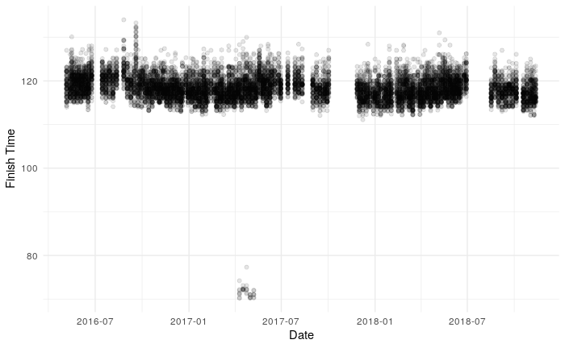

We see that there are some races with abnormally short finish times, and
it turns out that there were some abnormally short races. We eliminate
those races and forge on to our next nugget. When we do a histogram of
the finish times with the default binwidth, everything looks more or
less reasonable although we do see bimodality:

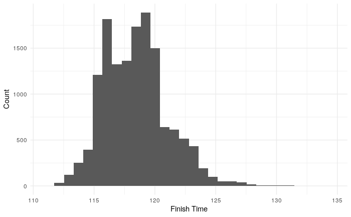

To investigate the bimodality, we try several different binwidths and
end up with this:

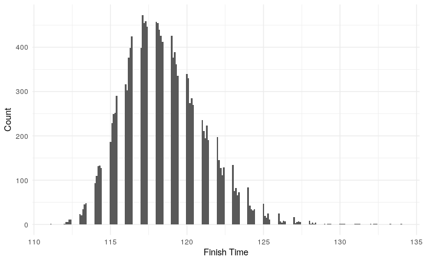

This should make you go hmmmm

Apparently years ago the races were timed with stop watches that had a
resolution of one fifth of a second. And in some places, to fit in
standard computer software, this was recorded like the numbers above. So
100.2 does NOT equal one hundred and two tenths of a second, rather it
equals (here) one hundred and two fifths of a second, i.e. 100.4
seconds. Easy enough to fix once it is found.

Next nugget? There were some days where the temperature changed by 31 C,
which does not seem possible. So we eliminate the days with more than
one weather record, and finally we also eliminate the days where the
track conditions were Heavy, as they represented a very small fraction
of the data.

## Now for some fun

Now that the data is fairly useful (I won’t say perfect – it never is)
we can start to do some interesting plots.

First the ggridges package (formerly joyplot) is great for producing
plots like this:

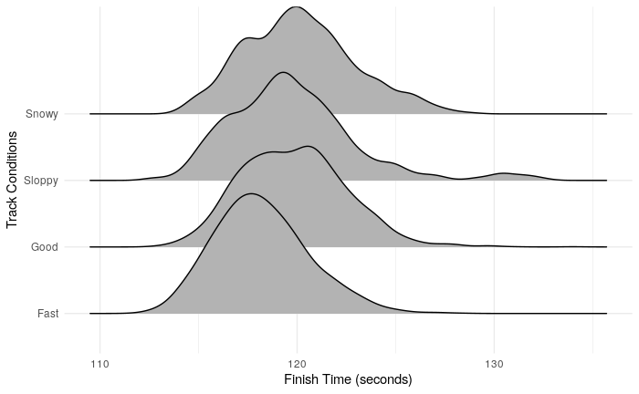

The code to generate the plot is simple, once the data frame has been
prepared:

``` r
df %>%
ggplot(aes(x = finish_time, y = cond)) +
geom_density_ridges() +
labs( x = "Finish Time (seconds)", y = "Track Conditions" )+
theme_minimal()
```

As you would expect Fast is faster than Good, Sloppy and Snowy. In
addition there seems to be a bump in Sloppy at about 131 seconds.
Perhaps we’ll investigate this in later entries to see if it is real or
a one off fluke.

One also has to be aware of what could be going on. Imagine you are the
jockey on a horse, and you are nowhere near the front of the pack
half-way through the race. You have choices: you could race the horse as
hard as you can and try to get into the top three in order to win some
of the prize money, or maybe you ease off so as to not unduly stress the
horse, so that she is better rested for the next race. If the latter is
the case, that would likely lead to a distribution with a longer tail to
the right.

One last plot for this week – how do the track conditions affect the
finish time?

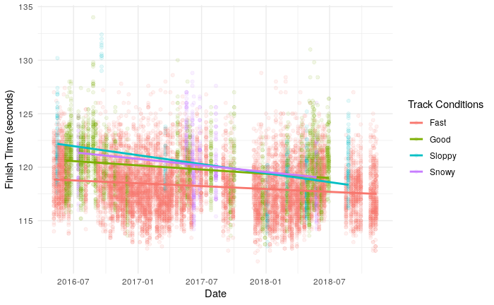

Again, the code is simple (I love R/tidyverse)

``` r
df %>% 
  ggplot(aes(x = date, y = finish_time, colour = cond)) +
  geom_point(alpha = 0.1) + 
  geom_smooth(method = "lm", se = FALSE) + 
  labs(x = "Date", y = "Finish Time (seconds)", colour = "Track Conditions" )+
  theme_minimal()
```

A couple comments:

-   I use `se=FALSE` in the `geom_smooth` because nothing I have done is
    remotely statistically proper, and to introduce error bars here
    would be misleading.

-   I used `method='lm'` because going with the default led to an error
    message, and for illustrative purposes it does not matter here. BUT
    assuming that the effect of the calendar on the finish time is
    linear is just wacky.

Next week We’ll start to get a little more statistically proper. We’ll
look at the effect of weather, race number, starting position, etc. on
the horse’s performance. At some point, in the not too distant future,
we will develop a simple statistical model that predicts the winner
about one third of the time, whereas if you just guessed, you’d be right
only about one eighth of the time….but you still won’t make money.

# Part V

## Introduction

This post was originally intended to be about looking at all the
variables in the data set and seeing what insights they might provide.
Then I realized that it is Derby weekend! If corona had not taken over
the world, today would be the [Kentucky
Derby](https://www.kentuckyderby.com/) – but it has been rescheduled to
September 5.

So, in honour of what is sometimes called “The Most Exciting Two Minutes
in Sports,” we will jump right to predicting winners in our data set.
The methods will be crude – flaws will be obvious and many. But, we will
get some interesting results, and the approach we take here will give us
a baseline to compare to, when we delve into fancier methods at a later
date.

You can find the .Rmd file for this week
[here](https://raw.githubusercontent.com/prabinov42/PoniesBlog/master/PoniesBlog5.Rmd).

## Setting the seed for reproducible research

Ok before we do *anything* else, we will run into the first time we
explicitly need to worry about reproducibility. I say explicitly because
already we have been doing reproducible work by putting everything into
a .Rmd document that we can knit into our final results. No need to
remember what we did, what transformations we applied to the data, etc.
This is huge, because nothing loses credibility as a data scientist
faster than somebody asking a question about how you got a result, and
you don’t remember and can’t figure it out. With knitr, etc all the code
is right there, so you can see exactly what was done, and each time you
run it you will get exactly the same results. There are many good
references for reproducible research with R, I have found this
[one](https://www.amazon.com/Reproducible-Research-RStudio-Chapman-Hall-dp-0367143984/dp/0367143984/ref=mt_paperback)
useful.

For this week, the main point will be to set the random seed, so that
the results I get are the same as the results you get. And of course, it
is trivial:

``` r
set.seed(2020)
```

## Picking the winner

Here is the plan. We will pick a date about halfway through the data set
in order to have some history to work with. Then from that day forward,
for each race, we will use data up to the day before that race as a
training set, build a model for the race, predict who will win, and move
on to the next race/day.

For each algorithm we will show how it works on one race, and then put
it into a function that can be called within two loops, an outer one for
each day, and an inner one for each race on that day.

### Random Choice

First we pull out the roster for this race.

``` r
race_roster <- df %>% filter(date == "2017-05-22", racenum == 3) 
```

Then we pick one of the horses at random using

``` r
our_pick <- sample(race_roster$hnum, 1) 
```

and see if it won with

``` r
our_picks_position <- race_roster %>% filter(hnum == our_pick) %>%
pull(pos) 

our_picks_position == 1 
```

We package this up as two functions

``` r
random_prediction <- function(this_date, this_race) { 
  race_roster <- df %>% filter(date == this_date, racenum == this_race) 
  our_pick <- sample(race_roster$hnum, 1) 
  return(our_pick) 
  }

did_we_win <- function(this_date, this_race, pred) { 
  race_roster <- df %>% filter(date == this_date, racenum == this_race) 
  our_picks_position <- race_roster %>% filter(hnum == pred) %>% pull(pos)
  return(our_picks_position == 1) 
  } 
```

which then allows us to run everything in two nested loops

``` r
dates <- sort(unique(df$date)) 
ld <- length(dates)

ans <- c() 
for (theDate in dates[(ld / 2):ld]) { 
  races <- df %>% 
    filter(date == theDate) %>% 
    pull(racenum) %>% 
    unique() %>% sort() 
  for (theRace in races) { 
    pred <- random_prediction(theDate, theRace)
    success <- did_we_win(theDate, theRace, pred) 
    ans <- c(ans, success) 
    }
}

ma <- mean(ans)
```

If we do this, we find that we correctly guess the winner about 13% of
the time. Of course we could have got the same answer by simply
calculating 1/(average number of horses in a race), but the purpose here
is to build a framework for more interesting algorithms, and it is best
to start simply.

### Pick the favourite algorithm

Here we will try another strategy – always picking the favourite. There
have been some studies that claim that the favourite is actually
under-priced. This is likely because people generally do not want to
risk (say) two dollars for the chance to win only fifty cents!

Our code has to change only a little.

``` r
favourite_prediction <- function(this_date, this_race) { 
  race_roster <- df %>% 
    filter(date == this_date, racenum == this_race) %>%
    arrange(final_odds) 
  our_pick <- race_roster %>% 
    head(1) %>%
    pull(hnum) 
  return(our_pick) 
  } 
```

Then adapting the loops and running the code yields picking the winner
about 42% of the time! This is impressive – the general betting public
seems to have a pretty good handle on who is and is not a good horse.

### The *normal* algorithm

We call this algorithm *normal* because it uses the normal distribution
in a completely inappropriate way.

In essence, for each race we assemble the history of each horse in the
race prior to the current race and use that as a trainingBase from which
to build models. It is really important here to not allow for any
leakage of the present or future into the trainingBase, which is only
data you would know at the time when you are predicting a winner. In
this case it is pretty trivial, but in more sophisticated problems it
can get tricky, so don’t say I didn’t warn you.

Ok, with the trainingBase, we do a linear model to predict the horse’s
finish_time, based just on the horse’s name.

`lm(finish_time ~ hname - 1, data = trainingBase)`

We use the `-1` in the `lm` because we do not want a constant here.
Basically this just estimates each horse’s average finish_time.

Here is where things get weird. We are going to *assume* that a horse’s
finish time is normally distributed with mean Estimate, and standard
deviation Std Error. So for each horse we can then simulate draws from
their finish time distribution, and once we have those we can see what
order the horses finished in. We simulate some large number of races
like this, and then for each horse calculate the fraction of simulated
races it won.

The code gets a little more complicated because there are a few new
error conditions to check for, such as:

-   what to do if there is no history at all?

-   what to do if a horse has run only one prior race? Then his std.err
    will be nan etc

If we do all this, adapt and rerun the loops, we find this algorithm
predicts the winner correctly about 22% of the time. Running the same
algorithm on an earlier, smaller data set yielded correct prediction
about 30% of the time. We may investigate this difference in a later
post.

#### Why is the normal distribution inappropriate here?

If you have done one statistics course, you may have come away with the
impression that the normal distribution is appropriate everywhere, and
should always be used. This is a false impression.

First of all, a normal distribution has a non-zero probability of being
less than zero – in other words, regardless of the parameters we could
predict some horse’s finish time to be less than zero. Predicting that a
horse finished the race before it even started is a bad idea.

Second, the shape of the distribution is quite likely not normal. We
will look at this a little more in the future, it is probably something
more like a shifted gamma distribution.

Using the standard error as the standard deviation is also just wrong.
The standard error is the standard deviation of our estimate of the mean
– a very different thing.

And we could find more flaws. But the point was to build a model we
could start with, and compare to. For example, maybe we could factor in
effects due to temperature, track conditions, etc. Also, since picking
the favourite worked about 40% of the time, including the final_odds as
an explanatory variable may be helpful.

## Conclusion

So if you want to bet, you could throw your money away by picking some
random horse, you could bet on the favourite and then if you win, you
win only a small amount of money, or you could try something fancier
than our normal algorithm above.

Over the next weeks we will go back to interrogating the data set, and
then discuss some betting strategies. One interesting thing we will try
to figure out is how good do we need to be at picking the winner to make
money?

And to go along with the derby week theme, I just finished reading [The
Race for the Triple
Crown](https://www.amazon.com/Race-Triple-Crown-Horses-Eternal/dp/0802138853/).
It was pretty good.

# Part VI

## Introduction

This week we return to data exploration in order to better understand
what variables seem to affect performance. These discoveries should
inform our model building in the coming weeks.

But first, a few words about last week.

-   There was a virtual Triple Crown event. You can watch it
    [here](https://www.youtube.com/watch?v=LSLhcYohp_M&feature=youtu.be)
    and read about it
    [here](https://www.kentucky.com/sports/horses/kentucky-derby/article242399436.html).

-   If that was too fast for you, then maybe the [Turtle
    Derby](https://www.youtube.com/watch?v=q1cFQpl_qkw) is more to your
    liking.

There are a couple reasons we did simulations last week:

-   We wanted to get a probability of winning, rather than just an
    estimate of the horse’s finish time. This will become important in
    later posts.

-   I said earlier that using just one number to describe anything that
    is not trivial is a lie – here we want to know (ideally) the
    probability of where a horse will finish (i.e. the *distribution* of
    finishing positions), as well as to know how much data these
    estimates were based on (how many simulated races, how much history
    for each horse, etc). All this is available from the simulations and
    can be used to inform our betting strategy. Surely you would trust
    an estimate based on 1000 simulations and history of length 50 more
    than 3 simulations based on a history of length two!

-   In the simple approach we took (normal distribution), it is possible
    to explicitly calculate the joint distribution of where each horse
    finishes, and then come up with the probabilities of winning, etc.
    But it would be error prone and complicated. Furthermore it would
    likely not extend to different distributions, additional factors,
    etc.

## [What difference does it make?](https://www.youtube.com/watch?v=XbOx8TyvUmI)

In this section we’ll look at a few plots to see how the various factors
we know about affect the final results. The code for this week’s plots,
and more, is in
[this](https://raw.githubusercontent.com/prabinov42/PoniesBlog/master/PoniesBlog6.Rmd)
.Rmd

First we’ll look at the odds: the betting public’s view of which horse
will win.

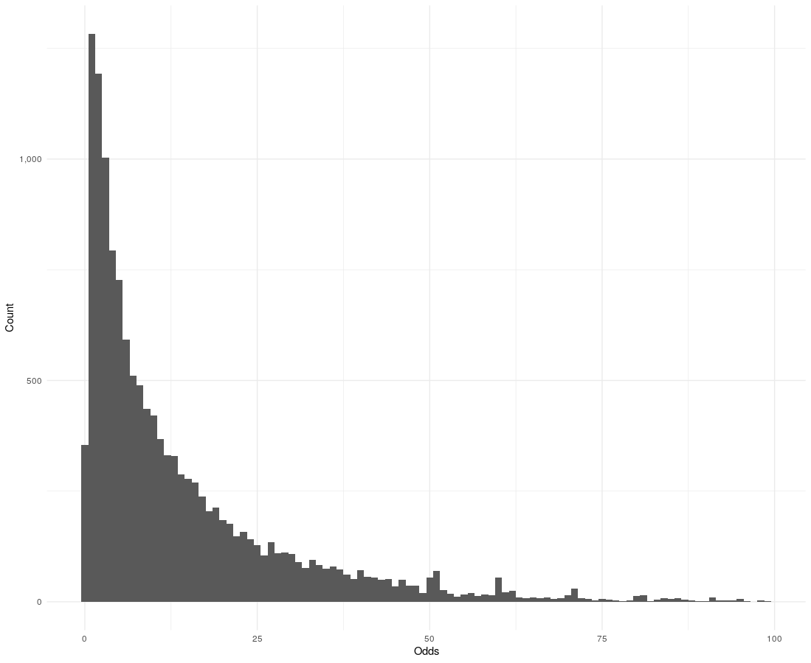

The distribution looks like it may come from, say, a
[Zipf](https://en.wikipedia.org/wiki/Zipf%27s_law) distribution. This
may be interesting to check later. There are weird peaks at 50, 60, 70,
and maybe 80 to 1. No guesses yet.

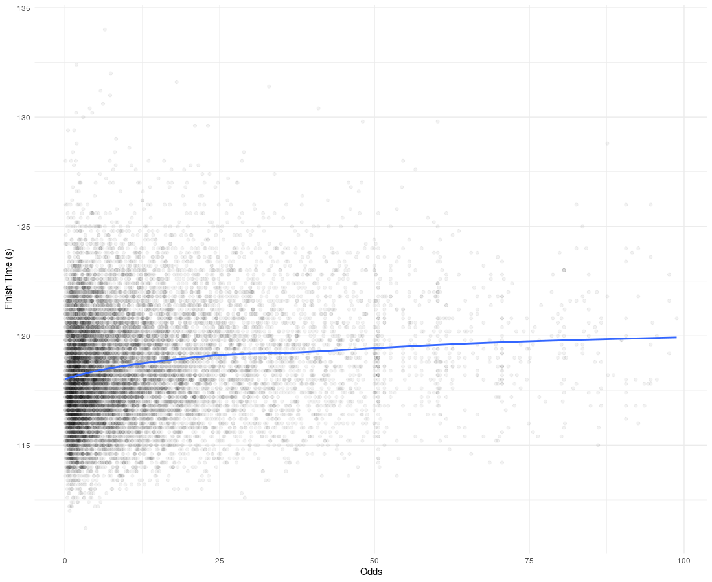

Here we see that (generally) the higher the odds, the slower the horse –
to be expected.

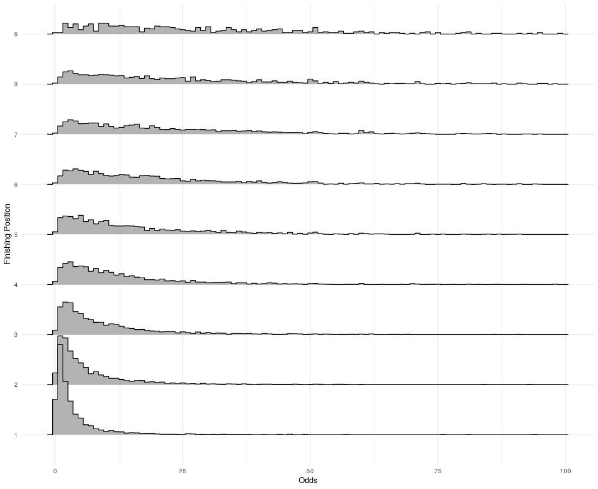

This plot shows the distribution of odds for each finishing position.
Note though that the higher the finishing position, the more horses were
in the race (obviously), and the smaller the sample size. Thus, for
higher finishing positions, the results should be viewed with a grain of
salt.

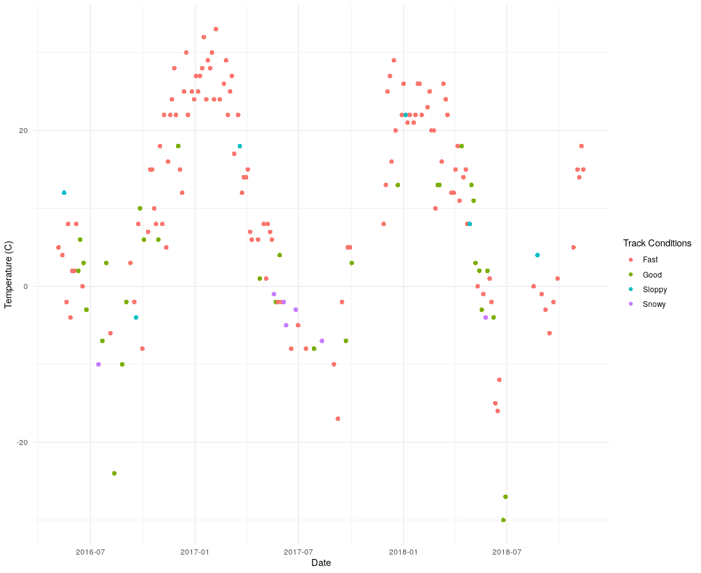

Here we see the conditions under which the races were run, and note the
relatively small number of races with snowy or sloppy conditions.

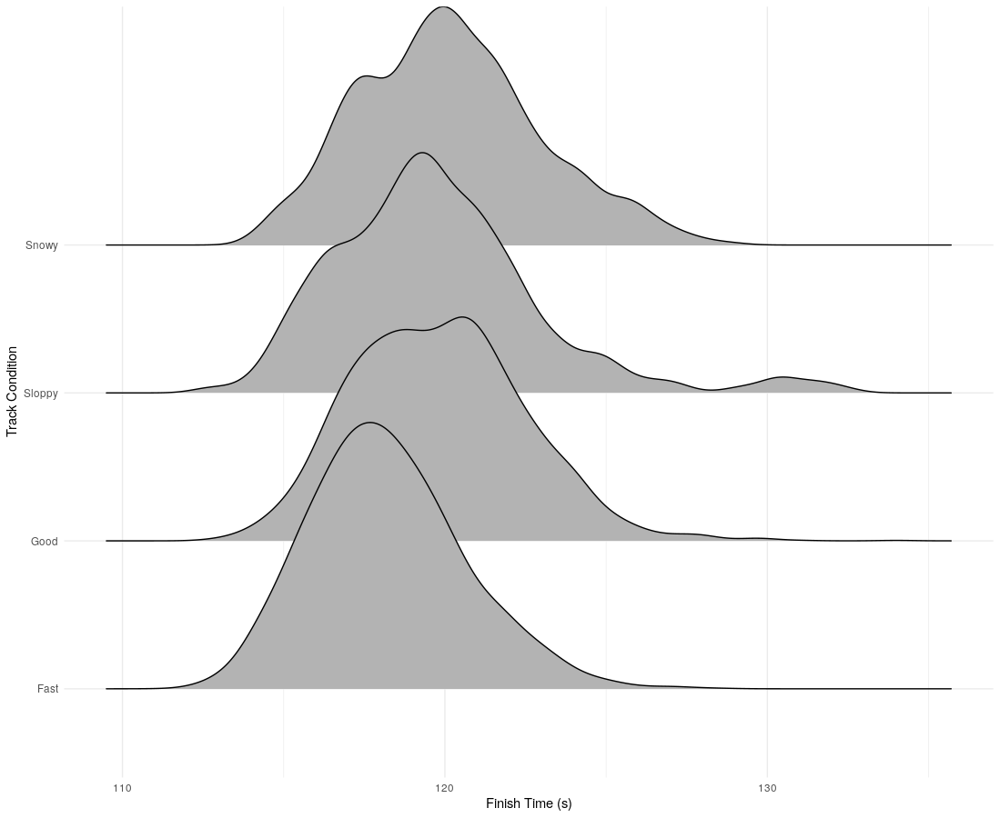

These are the densities of finishing times under different conditions.
Again the warning about small sample sizes for snowy & sloppy conditions
apply.

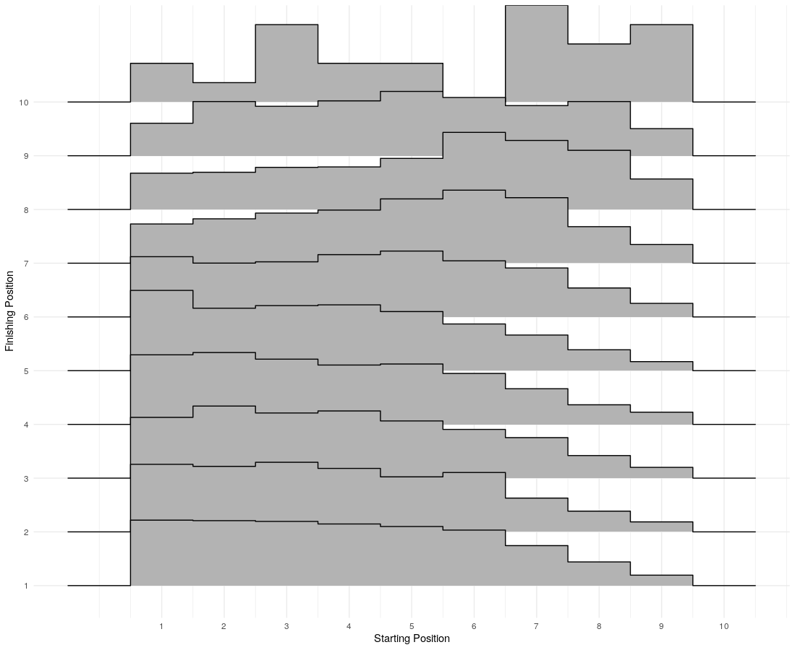

A lower numbered starting position is closer to the inside of the track,
and therefore such a horse has a very slightly shorter distance to run.
It seems that there might be an effect due to this, but if you ignore
races with seven or more finishers (which seems valid because there are
fewer races with more horses, and so the sample size is smaller), the
results are similar.

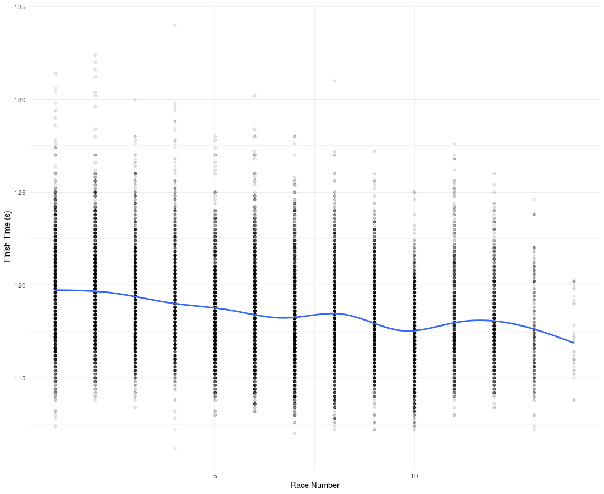

Here we see that the later races are typically faster than the earlier
races. This is to be expected, as the later races typically have larger
purses and therefore better horses.

Next we looked at one horse, Derrick, to see if the above results were
typical (they were). We chose him because he had run a large number of
races.

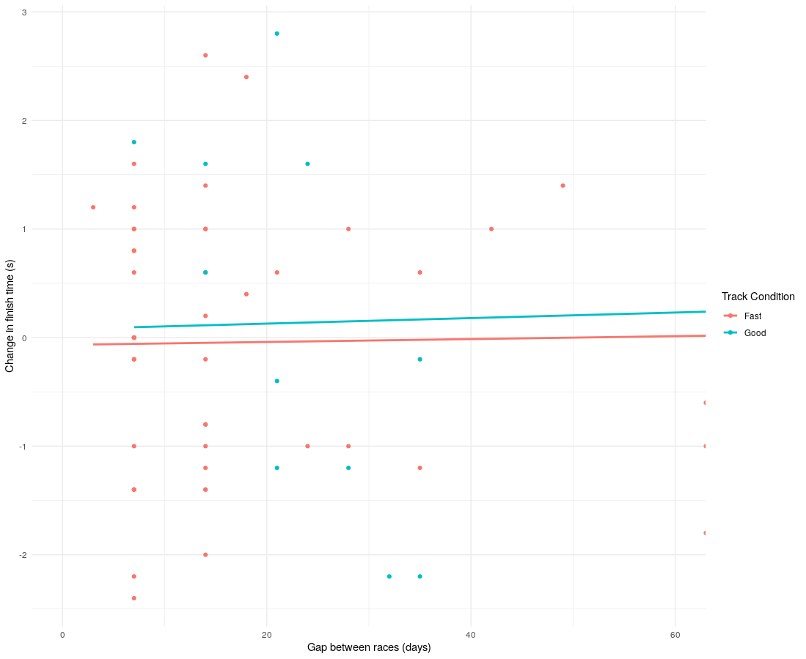

It might be thought that a few days rest will improve a horse’s
performance, or that too large a gap will slow him down. There are a few
large gaps in Derrick’s record, on the order of several months to almost
a year, so we filtered those out. The results are that there appears to
be minimal effect due to having days off.

## Conclusion

Now we have done a pretty good first pass through the data and know what
to expect. As things come up, we may end up doing more EDA, cleaning
etc. But for now, we’re on to more interesting things.

Next week – a few simple betting strategies.

# Part VII

Today would have been the Preakness Stakes, the second jewel in the
triple crown.

[Money for Nothing](https://www.youtube.com/watch?v=_zOjRlVpAOQ) is our
theme this week. Code is
[here](https://raw.githubusercontent.com/prabinov42/PoniesBlog/master/PoniesBlog7.Rmd).

So far we have focused on predicting who wins – but that is the wrong
metric. This comes up all the time in data science: we find a metric
that we think is highly indicative of success, and then work to optimize
that metric. If you work somewhere where they have MBO (management by
objectives), you have surely seen situations where the objective is
optimized, but it is the wrong objective. Here, what we really care
about is not who wins, but how much money we win. Now if we could
predict who wins all the time, we could then optimize our winnings
pretty easily, but that is not the case. So we will now switch our focus
to trying to maximize our winnings, one component of which is predicting
as well as we can.

We’ll proceed as before – develop what we need in a simple case, and
then turn it into a function to make using it easier.

## Betting schemes

We look at three betting schemes: choose a horse at random, bet the
favourite, or use the “normal” algorithm of two weeks ago.

At this point you may have noticed that the functions we create are very
simple – it is almost always better to start out simple and add what you
need when you need it than to try to anticipate every possibility. In
addition, it is well known that premature optimization is the root of
all evil – so our functions are not optimized in any way and can surely
be made faster with some effort – if the need ever arises.

All we need to add is a function that pulls out the odds for whatever
horse we predicted would win, which is a simple addition to the code we
already have.

``` r
get_odds <- function(theDate, theRace, thePick) { 
  odds <- df %>%
    filter(date == theDate, racenum == theRace, hnum == thePick) %>%
    pull(final_odds) 
  return(odds) 
  } 
```

The main loop of our code changes only a little

``` r
pred <- random_prediction(theDate, theRace)
success <- did_we_win(theDate, theRace, pred)
our_odds <- get_odds(theDate, theRace, pred)
incr <- if_else(success, theBet * (1 + our_odds), -theBet)
```

Here we will keep the bet fixed at $2, so the last line says that if we
win the increment to our fortune is the two dollars we bet, plus the
odds times the two dollars. And if we lose, we lose the two dollars.
Later we may adapt the bet to our confidence, fortune, etc – but for now
we keep it simple.

As you would expect, betting on horses at random does not do well:

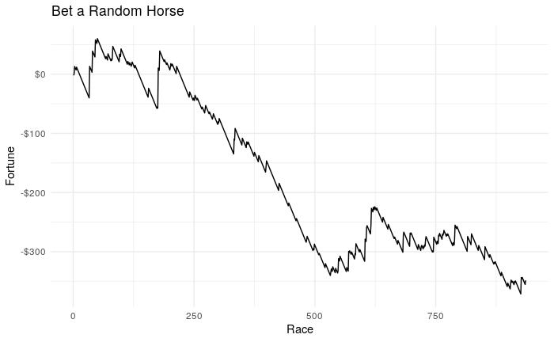

We see that occasionally we win, but overall our fortune decreases
pretty fast.

Next we try betting on the favourite in each race:

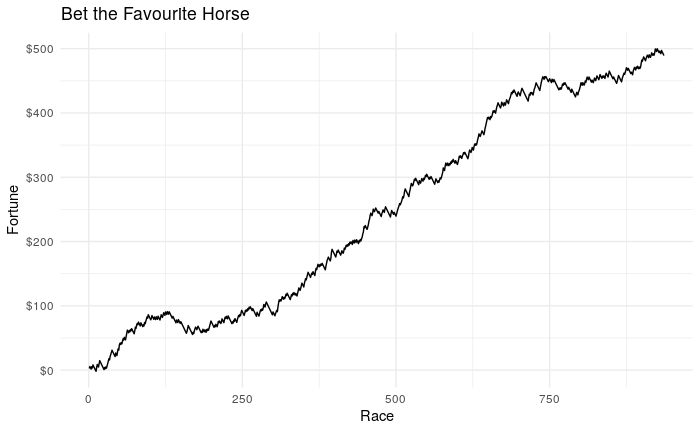

Holy crap that looks good!

Finally we’ll try the “normal” algorithm:

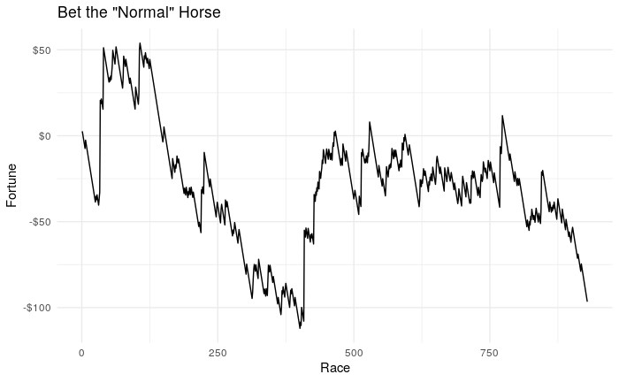

Well, that is disappointing!

## Conclusion

Ok, so this is data science at its finest! Sometimes, if you are really
lucky, in the middle of the night you know something that nobody else in
the world knows. That is what I love about data science. What usually
happens next is you go to sleep, wake up, take a shower, brew a pot of
coffee and try to figure out where you went wrong – especially if your
results look too good to be true. That is what we’ll do next week –
either figure out why the betting the favourite code is
wrong/inapplicable, or maybe, just maybe, there won’t be a post because
I will be on my brand new yacht in the Caribbean.

# Part VIII

No code this week, because we’ll be focusing on Kelly’s criterion.
[Kelly](https://www.youtube.com/watch?v=g_BMyy-0lvk) is somebody worth
reading about – in fact the whole history of applying math to gambling
is fascinating and illustrative. Follow up with the references, and
their references, and their references…. We will get back to our “yacht
or typo” dilemma next week.

## Optimal betting strategies

Here is one possible scenario that has been analyzed with some pretty
interesting results: bold play. You owe some bad people ten thousand
dollars, and if you do not give it to them tomorrow morning they will
kill you. You have only one thousand dollars. You walk into the casino,
and the only game available is roulette (American style, with both a
green 0 and a green 00), and the only bet you can make is red or black.
Thus your probability of winning is 18/38, about 0.47. If you win, you
double your bet, i.e. the payout is 1-1. The question is what betting
strategy do you use?

Most people initially think along the lines of betting (say) one hundred
dollars on the first round, and that way if they lose they still have
nine other chances to win. That, however is a bad strategy. The best
approach is to bet everything you have up until you have enough to pay
off the bad people, or just enough to pay them off. The reason,
intuitively, is that the odds of you winning are less than fair, and so
the fewer rounds you play, the better your chances – so minimize the
number of times you play. This strategy is known as bold play, and here
is a beautiful paper by
[Billingsley](https://www.jstor.org/stable/27852139?seq=1) that relates
the optimal betting strategy to things like non-differentiable
functions. And that is what I love about math – that a simple question
about how to maximize your chances of staying alive leads to some pretty
sophisticated results.

Other places you can read about this stuff at varying levels of
sophistication are:
[Poundstone](https://www.amazon.com/Fortunes-Formula-Scientific-Betting-Casinos/dp/0809045990/ref=tmm_pap_swatch_0?_encoding=UTF8&qid=1590069401&sr=1-4),
[Korner](https://www.amazon.com/Naive-Decision-Making-Mathematics-Applied-dp-0521731631/dp/0521731631/ref=mt_paperback?_encoding=UTF8&me=&qid=1590069454),
and for anything related to gambling
[Ethier](https://www.amazon.com/Doctrine-Chances-Probabilistic-Probability-Applications-dp-3662501678/dp/3662501678/ref=mt_paperback?_encoding=UTF8&me=&qid=1590069501)
is really wonderful. ([But what do I really think about
Ethier](https://www.maa.org/press/maa-reviews/the-doctrine-of-chances-probabilistic-aspects-of-gambling)?)

## Kelly’s Formula

Kelly’s Criterion is useful in more or less the opposite scenario. For
whatever reason, (eg using data science to predict winners in horse
races), you know better than the betting public what the chances of
winning are. So for example, although the payoff from the odds may say
the the general betting public thinks your horse has a 25% chance of
winning, your model predicts a 30% chance. Do you bet all your money? Of
course not – there is still a 70% chance your horse will lose. So what
amount do you bet? This is Kelly’s criterion.

Here is the set up:

We start with

unit of wealth and we bet a fraction

of that. We have the probability of winning
![P\left\[\text{win}\right\]=p](https://latex.codecogs.com/png.image?%5Cdpi%7B110%7D&space;%5Cbg_white&space;P%5Cleft%5B%5Ctext%7Bwin%7D%5Cright%5D%3Dp "P\left[\text{win}\right]=p")
and the odds (payoff) are

.

So, if we win, our wealth goes to
,
and if we lose our wealth goes to

.

Therefore the expected value of the logarithm of our wealth is
![E \left\[ \log\left( \text{wealth} \right)\right\]=p \log\left( 1+fb\right)+\left( 1-p\right) \log\left(1-f\right)](https://latex.codecogs.com/png.image?%5Cdpi%7B110%7D&space;%5Cbg_white&space;E%20%5Cleft%5B%20%5Clog%5Cleft%28%20%5Ctext%7Bwealth%7D%20%5Cright%29%5Cright%5D%3Dp%20%5Clog%5Cleft%28%201%2Bfb%5Cright%29%2B%5Cleft%28%201-p%5Cright%29%20%5Clog%5Cleft%281-f%5Cright%29 "E \left[ \log\left( \text{wealth} \right)\right]=p \log\left( 1+fb\right)+\left( 1-p\right) \log\left(1-f\right)")

Now we use calculus: we differentiate with respect to

to get

then we set this equal to

and solve for

to obtain the critical point


### Simple numerical examples

Here is the formula in action, in a simple case:

-   the odds are 7 to 1

-   the probability of our horse winning is 0.25

-   what fraction of our wealth do we bet?
    /b = (0.25\times7+0.25-1)/7=0.143").
    So we bet around 14% of our wealth.

What if the probability of our horse winning is only 1 in 7, i.e. 0.143?

-   /b = (0.143\times7+0.143-1)/7=0.02").
    So we bet around 2% of our wealth.

What if the odds are 1, but we think the probability of the horse
winning is only 1/4?

-   /b = (0.25\times1+0.25-1)/1=-0.5").
    Then f is -0.5, so we should not bet because the payoff doesn’t
    cover the risk.

This suggests looking at extreme cases.

When shouldn’t we bet? When f is 0:


then

and
=1")
so


So if our estimate of the probability of the horse winning is less than
or equal to

, we should not bet.

When should we bet everything? When

is
:

,
,
=b+1"),


This says that if we have a sure thing then there is no chance the horse
loses so then we should bet all our money!

### Why log?

Looking back at the explanation, one question that probably jumped out
at you is why did we use the logarithm of the wealth? There are several
reasons:

-   It is easy to work with and leads to a closed form solution

-   It can be shown that it maximizes rate of growth of our wealth

-   If we use logarithmic utility, then the marginal utility is
    inversely proportional to wealth

Utility? What is that? Utility is a function (there are many – each
person may have their own) that measures how much ‘utility’ you get from
money, given how much you already have. It encodes the simple
observation that if you are a struggling student, an extra thousand
dollars is huge, where as if you are Jeff Bezos, probably not so much of
a big deal.

In the simplest cases, utility functions are those functions

such that
,


but there are generalizations that exist where we don’t need
derivatives, just concavity, etc. You can find out much more in the
references above.

## *Slightly* more general

For any differentiable utility function, Kelly’s criterion says we
should find the

that solves the following equation, where

is our initial wealth (before we start betting).

\right)}{U'\left( w\left( 1+fb\right)\right)}")

Note that depending on your personal utility function, this may not be
so simple…

## Complications

But there are more complications awaiting us in our quest to make money
at the track. The formula assumes that

can be any real number, but in reality things are discrete:

-   there is a minimum bet size

-   you can not bet fractions of a cent

-   payouts are rounded to nearest nickel etc.

All these (and others) would need to be (and could be) taken into
account for a completely specified betting system. Or, as we may do
later, we can use the Kelly fraction

as a guide as to how much to bet, and if it tells us to bet 3.1415926,
we’ll just bet 3, and see how it works out.

## Conclusion

Kelly’s formula has been applied not only to gambling, but investment in
general. A quick Google search will return many references to follow up
on, and it is worth knowing about. Also excellent is [Against the
Gods](https://www.amazon.com/Against-Gods-Remarkable-Story-Risk/dp/0471295639).

*Somebody* is bound to read this and say the equivalent of ‘What if I
bet two dollars on the first race and if I win, I walk away. If I lose I
bet four dollars on the second race, eight on the third, etc and so on
until I win’. If you are this person, please read the references above
before mortgaging your house.

# Part IX

There have been no blogs for the past few weeks because, to steal a line
from the late, great Niki Lauda “There are more important things in life
than bloody horse racing”.

But data science at its best is about extracting nuggets of truth from
available data – so perhaps join one of the many groups trying to help
make this a better place: Google “Data for Good”, “DataKind”, “Data for
Black Lives” to join in a community of data scientists who are trying to
use their skills to make things better.

Or find some data sets on your own and data science the hell out of them
and post your results.

If you need a break and ponies and data science provides some escape
and/or skills, then read on. And appropriately, today is the Belmont
Stakes – usually the third jewel in the Triple Crown, but this year the
first.

## Yacht or Typo?

A few weeks ago we had a simple strategy (just bet on the favourite)
that looked like it was a winner. I was suspicious, and said that either
there was a problem with the code (typo), or I’d not be writing for a
while because I’d be on my yacht in the Caribbean. Well, the fact that I
am writing this blog a few weeks later should lead you to conclude that
I do not have a new yacht!

Doubting your results when they are too good to be true is an essential
part of data science, as is Twyman’s law which states that “Any figure
that looks interesting or different is usually wrong”. So here we poke &
prod to find out where we went wrong.

Also note that the
[code](https://raw.githubusercontent.com/prabinov42/PoniesBlog/master/PoniesBlog9.Rmd)
is a little rough this week. Consider it an exercise for the reader to
clean it up.

## Possible explanations

Last time, it looked like we would win about $500, which seemed too good
to be true.

One possible explanation is that we were very lucky. Recall we only
started predicting half-way through the data so that we’d have some
history to use to make predictions. But betting on the favourite doesn’t
require any history – so if we ran this scheme against the whole data
set, maybe we wouldn’t do so well? A simple change to one line of code
allowed us to check that, and that was not the explanation.

The next step was a painful walk through all the code, making sure each
piece of it did what I thought it did. And it did. So that isn’t the
problem.

Looking for clues, I thought of having a look to see how much we won
each race.

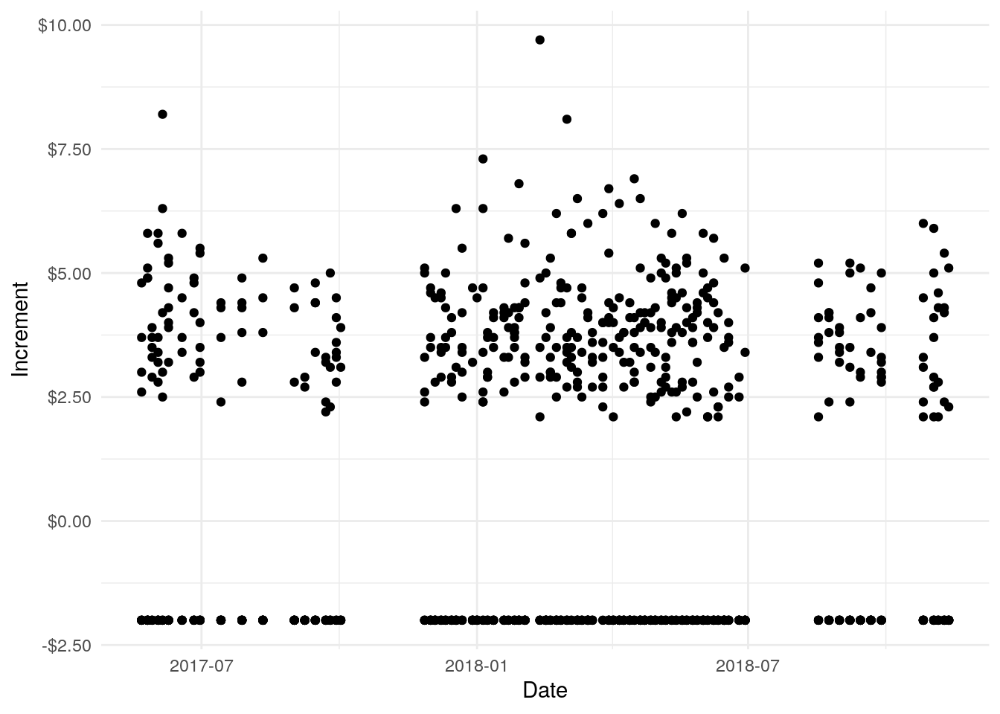

A few points about this plot:

-   There are many races on each day, as expected.

-   We see a bunch of races where the increment (amount won or lost) is
    losing two dollars. Those are the races where the horse with the
    lowest odds (the favourite), i.e. the one we picked, did not win.

-   There are some races where our pick, which is the horse with the
    best odds, incremented our fortune by almost ten dollars. That seems
    strange. Recall that if we win, we get back our original bet (two
    dollars) and then the odds multiplied by the two dollars. So, that
    means the odds on the horse that incremented us almost ten dollars
    must have been (10-2)/2=4, about 4 to 1. And that was the
    favourite??? That seems unlikely.

The next step was to look at the races where the odds of the winner were
(relatively) high. There were three extreme examples:

-   One race had four horses that all had odds about three to one. This
    is the rare case where there was little to differentiate between the
    horses.

-   Two races yielded an important clue: the number of horses was not
    the same as the highest numbered horse in the race. For example,
    horses numbered 1,2,5 and 6 showed results. So what happened to
    horses numbered 3 and 4?

Next was what I dreaded the most – delving back into the parsing code
and making sure that was working. Turns out the code was fine, and the
data was fine – the original raw data showed exactly what was in the
data frame we have been working with.

It looks like the only horses being recorded are those that finish the
race. Thus in some cases there were horses that ran but were
disqualified or did not finish (injury, etc). And so when we choose the
favourite from this list, it is the favourite from the horses that
finished, not the ones that started the race, and so our results are
biased – but by how much?

## Solution

The first thing is to figure out how many races were complete, and
determine how much we would have won/lost on those. That was easy
enough, with the result being that our fortune would be about 265
dollars.

What about the incomplete races? Here we have to make assumptions: we’d
win the same fraction, and with the same odds as in the complete races.
(Check the code for details)

Add all that together and we end up with fortune of about four hundred
dollars, about a hundred dollars less than before.

## Conclusion

So, we found one factor that lowered our love of the bet the favourite
strategy. And there were enough approximations and assumptions to make
the results that remain a little sketchy. Not enough to discount the
strategy, but not enough to mortgage the house either. Just enough to
suggest this requires more work and potential blog entries!

# Part X

A few weeks ago we looked at Kelly’s formula. And a few weeks before
that, we developed a winner prediction scheme that had about 25%
accuracy. Now we’ll show how to use Kelly’s formula with these
predictions, and you will see why we needed a probability of winning,
rather than just a best guess at who the winner was.

## Applying Kelly’s Formula

As you can see (far) below, betting two dollars in every race on our
predicted winner didn’t work out so well. So here we will try applying
Kelly’s formula, and see how that works out.

Kelly’s formula requires a non-zero starting fortune, as its
recommendation is to bet a fraction of your current fortune, and if your
fortune is zero, well…. So we will start with one hundred dollars.

Also, to start we will assume that we can bet any amount of money, even
something ridiculous like 3.1415926 dollars.

We use the Kelly formula from below, and modify our normal_prediction
function to return not only the winner, but also the probability of that
horse winning. See the code
[here](https://raw.githubusercontent.com/prabinov42/PoniesBlog/master/PoniesBlog10.Rmd)
for details.

The results are less than stellar:

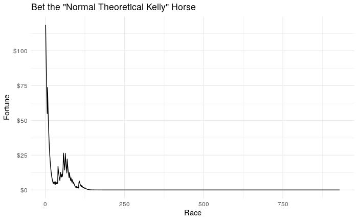

In the above plot, I label it *theoretical* because the bets made can be
any amount. In the following, we will make the simulation more realistic
by:

-   ensuring a bet is at least two dollars, and

-   rounding any bets off to the nearest dollar

Note that this will necessarily worsen the results, but is more
realistic.

The results, however, ugggh.

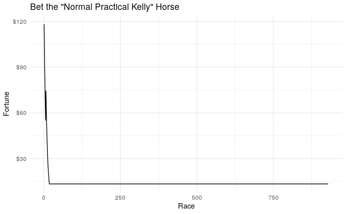

## Conclusion

So now we’ve seen how to apply Kelly’s formula. We see why we need
probabilities, not just to know the predicted winner, and have seen how
to modify Kelly’s formula to make it practical. The disappointing
results are not a flaw of Kelly’s formula (which under the appropriate
assumptions is a theorem, i.e. proved), but rather of our crappy
prediction algorithm.

Next time we’ll address the question of how good our predictions have to
be in order to make money – do we need to be correct 100% of the time?
(of course not) … 50%? ….25%?

# Part XI

In earlier posts we looked at a few different prediction schemes, and
then we looked at using Kelly’s formula to get an optimal betting
strategy. We’ll get back to Kelly in a bit, but first there is one
question we should address sooner rather than later, and that is how
accurate do we have to be to make money? If it turns out that we only
have to pick the winner 20% of the time, that is a much easier task than
predicting the winner in 90% of the races. So that is what we’ll address
now.

Just about all the
[code](https://raw.githubusercontent.com/prabinov42/PoniesBlog/master/PoniesBlog11.Rmd)
is the same, just used in different ways. Note some of it takes a long
time to run.

## How good is enough?

The musical equivalent is, of course, ‘[How soon is
now](https://www.youtube.com/watch?v=bB5bSZmuP90)?’.

Here is how we will proceed. In each race we will pick a horse uniformly
at random. And in a fraction p of the races we will pick the winner. Of
course some of the ones we choose randomly will be winners too, so we
shouldn’t expect the win probability to be exactly p, but rather
something higher. So we will calculate the actual win probability at
each level of p.

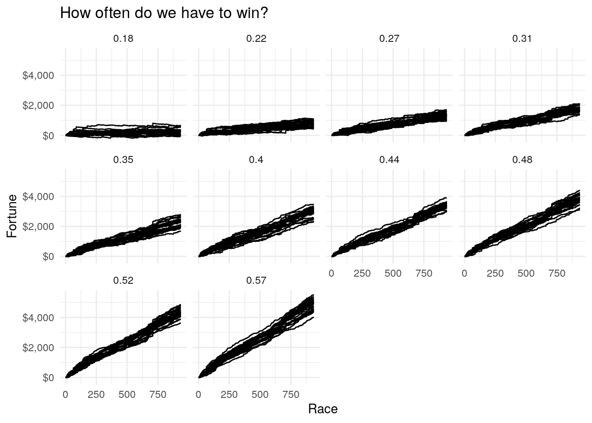

And so it appears that if we can predict the winner about 30% of the
time, we should make money. Note that this result should be tempered by
the many assumptions and shortcuts we took (eg this is all races, and
does nothing about the dnf’s we discussed a few weeks ago). But it does
put a stick in the ground – we don’t have to be 100% accurate, but we
can’t be complete idiots either.

## Conclusion

We now have a target accuracy – we need to be able to predict roughly
30% of the winners to have a decent chance of making money. This kind of
result, a ballpark figure to guide us, is hugely valuable. In data
science projects (as in any other project) it is always important to
know when you are done – when the result is good enough. Otherwise it is
too easy to spend huge amounts of time seeking epsilons of improvement.

# Last Words

Ok, back to current time frame here. If I were redoing this project from
scratch I suspect the code would be a lot cleaner, and the explanations
a lot clearer.

But that is data science - you try your best and see how it goes. And
next time you do it a little bit better.

# Appendices

<details>
<summary>
References
</summary>

For R and the tidyverse [R for Data Science](https://r4ds.had.co.nz/)

</details>
<details>
<summary>
SessionInfo
</summary>

``` r
sessionInfo()
```

    ## R version 4.1.2 (2021-11-01)
    ## Platform: x86_64-apple-darwin17.0 (64-bit)
    ## Running under: macOS Big Sur 10.16
    ## 
    ## Matrix products: default
    ## BLAS:   /Library/Frameworks/R.framework/Versions/4.1/Resources/lib/libRblas.0.dylib
    ## LAPACK: /Library/Frameworks/R.framework/Versions/4.1/Resources/lib/libRlapack.dylib
    ## 
    ## locale:
    ## [1] en_CA.UTF-8/en_CA.UTF-8/en_CA.UTF-8/C/en_CA.UTF-8/en_CA.UTF-8
    ## 
    ## attached base packages:
    ## [1] stats     graphics  grDevices utils     datasets  methods   base     
    ## 
    ## other attached packages:
    ##  [1] lme4_1.1-30     Matrix_1.4-1    broom_1.0.0     janitor_2.1.0  
    ##  [5] DT_0.22         knitr_1.39      ggridges_0.5.3  patchwork_1.1.1
    ##  [9] skimr_2.1.4     lubridate_1.8.0 tictoc_1.0.1    forcats_0.5.1  
    ## [13] stringr_1.4.0   dplyr_1.0.9     purrr_0.3.4     readr_2.1.1    
    ## [17] tidyr_1.2.0     tibble_3.1.7    ggplot2_3.3.6   tidyverse_1.3.1
    ## 
    ## loaded via a namespace (and not attached):
    ##  [1] Rcpp_1.0.9        lattice_0.20-45   assertthat_0.2.1  digest_0.6.29    
    ##  [5] utf8_1.2.2        R6_2.5.1          cellranger_1.1.0  plyr_1.8.6       
    ##  [9] repr_1.1.3        backports_1.4.1   reprex_2.0.1      evaluate_0.15    
    ## [13] httr_1.4.2        pillar_1.7.0      rlang_1.0.4       readxl_1.4.0     
    ## [17] minqa_1.2.4       rstudioapi_0.13   nloptr_1.2.2.3    rmarkdown_2.14.1 
    ## [21] splines_4.1.2     htmlwidgets_1.5.4 munsell_0.5.0     compiler_4.1.2   
    ## [25] modelr_0.1.8      xfun_0.30         pkgconfig_2.0.3   base64enc_0.1-3  
    ## [29] htmltools_0.5.2   tidyselect_1.1.2  fansi_1.0.3       crayon_1.5.1     
    ## [33] tzdb_0.2.0        dbplyr_2.1.1      withr_2.5.0       MASS_7.3-54      
    ## [37] grid_4.1.2        nlme_3.1-153      jsonlite_1.8.0    gtable_0.3.0     
    ## [41] lifecycle_1.0.1   DBI_1.1.1         magrittr_2.0.3    scales_1.2.0     
    ## [45] cli_3.3.0         stringi_1.7.8     fs_1.5.2          snakecase_0.11.0 
    ## [49] xml2_1.3.3        ellipsis_0.3.2    generics_0.1.2    vctrs_0.4.1      
    ## [53] boot_1.3-28       tools_4.1.2       glue_1.6.2        hms_1.1.1        
    ## [57] fastmap_1.1.0     yaml_2.3.5        colorspace_2.0-3  rvest_1.0.2      
    ## [61] haven_2.4.3

</details>
